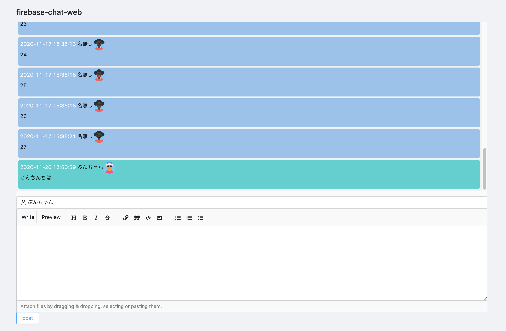
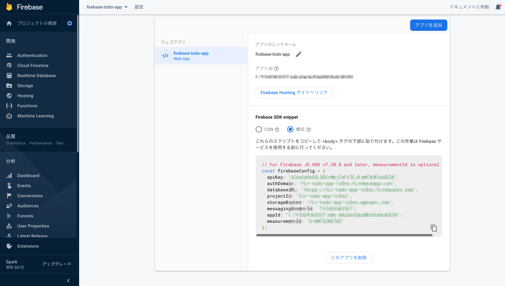

## 環境構築

```sh
# clone してディレクトリ移動
git clone https://github.com/redimpulz/firebase-chat-app.git

# firebase-chat-app に移動
cd firebase-chat-app

# ライブラリのインストール
yarn

# FirebaseコンソールからFirebaseアプリを作成

# ウェブアプリを作成しfirebaseConfigの情報を.envファイルに貼り付ける
```

- [Firebaseコンソール](https://console.firebase.google.com/)

以下、firebaseConfig参考画像



## コマンド

### 開発用コマンド

```sh
yarn dev
```

- topページ
  - <http://localhost:3000>